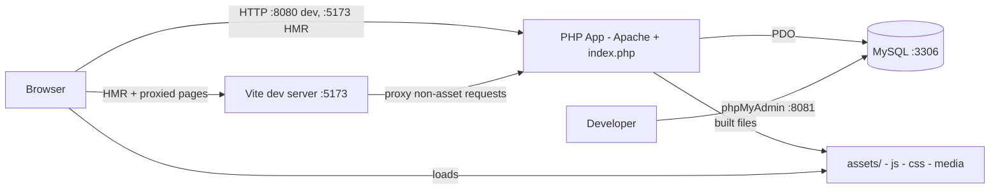
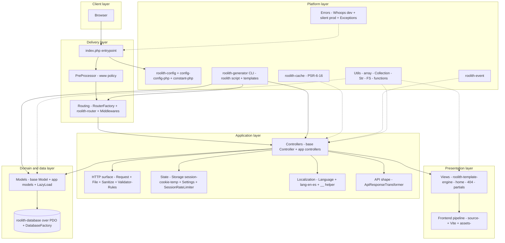
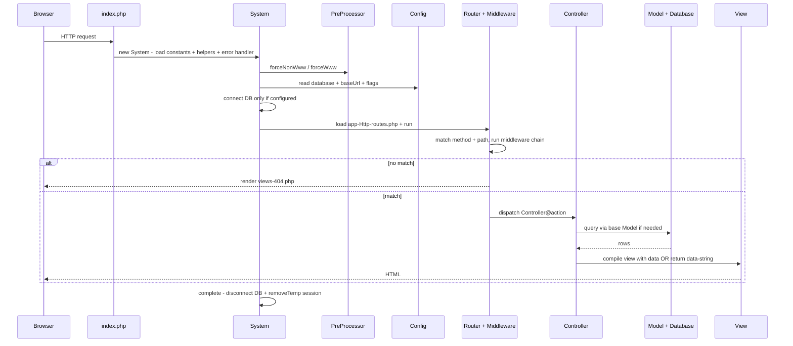

# Roolith Framework - System Architecture

> Canonical source: this file (`ARCHITECTURE.md`) is the single source of truth. `documentation/docs/architecture.md` is a short mirror with a pointer back here; update this file first and keep the mirror in sync.

This document describes Roolith at the system level: what the major parts are, how a request flows through them, and where to extend the system. It intentionally omits implementation details such as method signatures and class internals.

Audience: developers building apps on Roolith, and contributors evolving the framework itself.

## 1. System overview

Roolith is a minimal, synchronous PHP micro-framework with an MVC shape. One PHP entrypoint boots shared services, routes one HTTP request to one controller action, optionally touches a relational database, renders a PHP view or returns data, then tears down per-request resources.

The framework itself is thin glue (`app/`, `config/`, `views/`, `index.php`, `constant.php`) over seven standalone, composable Roolith libraries shipped via Composer (`router`, `config`, `database`, `template-engine`, `cache`, `event`, `generator`), plus two third-party services (`nesbot/carbon` for time, `filp/whoops` for dev errors). There is no DI container, no background worker, and no built-in ORM relationship manager. Shared services are exposed through small singleton factories and static facades.

## 2. Design principles

- Minimal core, composable packages: each `roolith/*` library is usable outside the framework, and the app only pays for what it configures (for example the database connection is skipped when `database` config is null).
- Convention over configuration: fixed locations for routes (`app/Http/routes.php`), controllers (`app/Controllers`), models (`app/Models`), views (`views/`), config (`config/config.php`), and constants (`constant.php`).
- Synchronous request scope: all per-request state lives in PHP superglobals and the session; cleanup (`disconnect`, `removeTemp`) happens at the end of each request in `System::complete()`.
- Explicit extension points instead of hidden magic: routes, middleware, base `Controller`, base `Model`, view partials, language files, generator templates, and the optional CMS mode (`APP_ENABLE_CMS`).
- Observable early: Vite HMR plus full-page reload on PHP change in development, and Whoops error pages outside production.

## 3. System context (C4 level 1)

In production the browser talks directly to the PHP container (or any Apache/PHP host); Vite and phpMyAdmin are development and operations aids. The only durable runtime dependency is MySQL, and it is optional: with `database` set to null the app runs without any database.

## 4. Container and layered architecture (C4 level 2)

Dependency rule: delivery depends on application, application depends on domain/data and presentation, and everything depends on the platform layer. The reverse never happens: the vendor libraries never import from `App`.

## 5. Request lifecycle

The happy path is `bootstrap -> processRequest -> complete`, all orchestrated by `App\Core\System` from `index.php`.

Key lifecycle facts: session is started in `index.php`; `PreProcessor` may redirect before routing; `complete()` always clears one-shot temp session data and disconnects the database; unhandled bootstrap errors are printed as plain messages while dev runtime errors render through Whoops.

## 6. Subsystems

### 6.1 Entrypoint and bootstrap (`index.php`, `app/Core/System.php`, `constant.php`)

Owns process boundaries: defines `APP_ROOT`, sets timezone, starts the session, loads Composer autoloading, then delegates to `System`. `System` loads path constants (`ROOLITH_CONFIG_ROOT`, `APP_VIEW_ROOT`), the optional CMS constants file, and global helpers; registers the error mode; applies URL canonicalization; lazily connects to the database; loads routes; and cleans up after the response. This is the only place that knows the full startup and shutdown order.

### 6.2 Configuration and environment (`config/config.php`, `roolith/config`, `constant.php`, `app/Utils/functions.php`)

Two tiers: build-time constants (view root, config root, `APP_ENABLE_CMS`, optional `ROOLITH_ENV`) and runtime config (`baseUrl`, `viteDevServer`, `database`, `forceNonWww`, `version`). Helpers expose environment predicates (`isDevEnvironment`, `isProductionEnvironment`), URL builders (`url`, `route`, `redirectToRoute`), and versioned asset URLs (`getVersion`). An unset `APP_ENV` defaults to production (fail-closed); only exactly `APP_ENV=development` enables Whoops/verbose errors.

### 6.3 Routing and middleware (`app/Http/routes.php`, `app/Core/RouterFactory.php`, `app/Middlewares`, `roolith/router`)

`RouterFactory` holds one shared router instance. `routes.php` configures `baseUrl` and view directory, declares HTTP verb routes to closures or `Controller@method` strings, assigns names for reverse routing (`route('welcome.form')`, `getActiveRoute()`), and conditionally mounts CMS routes when `APP_ENABLE_CMS` is true. Middleware extends the router base `Middleware` and votes allow or deny via `process(request, response)` before the controller runs. The router also owns the 404 fallback to `views/404.php`.

### 6.4 Controllers (`app/Controllers/Controller.php`, app controllers)

Controllers are the application orchestration point: read input via `Request`, validate via `Validator`, load data via models, pick an HTML view or a data response. The base `Controller` only provides view compilation through a shared template engine instance preconfigured with `baseUrl`. Controllers stay thin by pushing sanitization, validation, persistence, and formatting into their respective subsystems.

### 6.5 Presentation (`views/`, `roolith/template-engine`, `app/Core/TemplateEngineFactory.php`)

Server rendering uses plain PHP templates with `inject` for partials (`partials/header`, `partials/footer`) and `escape` for output. `TemplateEngineFactory` binds the engine to `APP_VIEW_ROOT` once. Standard views are `home.php` for the demo page and `404.php` for unmatched routes. Custom view engines are a documented extension point; controllers only depend on compile-by-name semantics.

### 6.6 HTTP surface (`app/Core/Request.php`, `File.php`, `Sanitize.php`, `Validator.php`, `Rules.php`, `ValidatorRules.php`)

`Request` is a static facade over `$_GET`, `$_POST`, `php://input`, `$_FILES`, `$_COOKIE`, and `$_SERVER`, returning raw values with output-at-render escaping (validate by type with `Validator` plus `Rules`, escape in views with `escape()` or `$this->escape()`). `Sanitize` is narrow: `param()` for URL slugs and `email()` for email lookups; `any()` plus `string()` plus `items()` are legacy for BC. `Validator` checks an input map against a fluent `Rules` declaration per field and reports `success`, `fails`, and `errors`. `File` validates extension, size, and upload error, then moves uploads through the `FS` utility. Together they form the trust boundary between the network and the app.

### 6.7 Domain and data (`app/Models/Model.php`, app models, `app/Core/LazyLoad.php`, `DatabaseFactory.php`, `app/Database/Migrator.php`, `roolith/database`)

The base `Model` binds one class to one table (`protected string $table`) plus primary key (`$primaryColumn`, default `id`) and exposes three access styles: full-table fetch (`all`), fluent query builder (`orm`), and raw connection (`raw`). Validated writes filter through `$fillable`, cast reads through `$casts`, and check `validate()` plus `validationRules()` before insert or update; `DatabaseFactory::transaction(fn)` keeps multi-write paths atomic. `DatabaseFactory` holds one shared PDO-backed `Database` in non-debug mode. There are no declarative relations; `LazyLoad::with(model, foreignKey, localKey)` performs one batched manual eager load and attaches results to a result set. `App\Database\Migrator` (`php roolith migrate`, `migrate:status`, `migrate:create`, `migrate:rollback`) tracks schema in a `migrations` table under `database/migrations`; `App\Database\Seeder` (`php roolith seed`, `seed:status`, `seed:create`, `seed:run`) tracks seed data in a `seeds` table under `database/seeders`; custom ORMs (including Cycle ORM) remain documented patterns.

### 6.8 State and abuse control (`app/Core/Storage.php`, `Settings.php`, `SessionRateLimiter.php`)

`Storage` wraps cookies, sessions, and one-shot flash data (`temp` read once per next request, cleared in `System::complete`). `Settings` persists the locale in a cookie with an `en` default. `SessionRateLimiter` tracks timestamps per key in the session and reports `tooManyAttempts` inside a sliding window, with explicit `clear` on success. All three are session-backed and therefore single-server local unless the deployer externalizes PHP sessions.

### 6.9 Localization (`app/Core/Language.php`, `Lang.php`, `lang/en`, `lang/es`, `Str`)

`Language` lazy-loads `lang/{locale}/message.php` dictionaries; the global `trans()` helper (with `__()` as a BC alias) resolves dotted keys for the active locale from `Settings::getLang()`. Missing keys or locales return null so views fall back. Adding a locale is adding one directory plus message file, with no code change.

### 6.10 Standard utilities (`app/Utils/_.php`, `Collection.php`, `Str.php`, `FS.php`, `functions.php`, `app/Support/*`, `ApiResponseTransformer.php`)

Framework-wide helpers with no HTTP or DB dependencies: array manipulation (`_`), fluent lists (`Collection`), strings and messages (`Str`), filesystem (`FS`), and namespaced supports (`App\Support\Debug` for CLI-aware `p()`, `Url` for `url()` plus `route()`, `Translator` for `trans()` plus `__()`, `Redirect` for `redirect()`, `Html` for `escape()`, `IdGenerator` for crypto IDs) with thin global BC aliases in `functions.php`, plus IP detection, dates via Carbon, and Vite tags. `ApiResponseTransformer` standardizes JSON-style envelopes as `{status, payload, message}` for API actions.

### 6.11 Platform packages (`vendor/roolith/*`, `vendor/nesbot/carbon`, `vendor/filp/whoops`)

The seven Roolith packages provide routing, configuration, database access, templating, PSR-6/16 caching, events, and scaffolding. Cache and event are shipped capabilities consumed on demand by app code rather than wired into every request: cache `CacheFactory::put()` plus `get()` plus `has()` for expensive config or model-query reads (see `App\Examples\CacheAndEventExamples::cachedModelQuery()`), events `Event::listen()` plus `Event::trigger('user.created')` for decoupled side effects like welcome mail (see `CacheAndEventExamples::userCreated()`). Composer constraints use caret (`^`) deliberately so patches flow; exact pins require a comment. Carbon standardizes dates and cookie expirations; Whoops standardizes dev diagnostics. This separation keeps the framework replaceable piece by piece.

### 6.12 Scaffolding (`roolith` script, `app/Core/generator-templates`, `roolith/generator`)

The `php roolith generate` CLI stamps out controllers, models, and middleware from text templates into their conventional directories. It accelerates bootstrapping but imposes no runtime dependency; generated files are ordinary app code from then on.

### 6.13 Frontend delivery (`source/`, `assets/build`, `vite.config.mjs`, `package.json`, `postcss.config.cjs`)

Authoring lives in `source/js/app.js` and `source/scss/app.scss`; built output lives in `assets/build/js` and `assets/build/css` (content-hashed in prod via `assets/build/.vite/manifest.json`). Two modes exist: HMR mode when `viteDevServer` points at `http://localhost:5173` (Vite serves assets and proxies all other paths to PHP on `:8080`, with full reload on PHP edits), and static mode otherwise (views emit hashed `assets/build/` URLs via `viteJs` and `viteCss`). Optional admin entries from the CMS release asset are picked up only if their source files exist. Uploads live outside the build output (`public/uploads/` or `storage/`). The PHP app never bundles JavaScript itself; it only emits the correct script and link tags per mode.

### 6.14 Operations (`Dockerfile`, `docker-compose.yml`, `docker-compose.prod.yml`, `.htaccess`, `documentation/`)

Local parity comes from Apache/PHP app on `:8080` (dev bind-mounts the repo, prod-like `docker-compose.prod.yml` runs from the `COPY` with a named volume for `public/uploads`), MySQL 8 on `:3306` with a `mysqladmin ping` healthcheck plus `depends_on: service_healthy`, and phpMyAdmin on `:8081` (dev only). `.htaccess` routes clean URLs to the front controller and denies `installer.zip` with 404. The optional CMS admin sources stay tracked in git as `installer.zip` for reference and local install (owner decision Sep 2026) but are omitted from dist via `composer.json` `archive.exclude` plus `.gitattributes` `export-ignore` plus `.dockerignore` (see `documentation/docs/cms-installer.md`). `documentation/` is a VitePress site describing recipes (dotenv, mail, migrations, seeders); it is documentation-only and not part of the runtime.

## 7. Data architecture

The operational data store is MySQL accessed over PDO through `roolith/database`. The base model assumes one table per model class and a single-column primary key defaulting to `id`. Reads flow `Controller -> Model::orm() -> Database -> MySQL`; writes use the same path. Ephemeral state (flash messages, rate-limit counters, locale cookie reference, language dictionaries) lives in the session, cookies, or in-memory per request. File uploads land on the local filesystem via `FS::upload`. No cache or queue is required for the default flow.

## 8. Cross-cutting concerns

- Error handling: Whoops pretty pages in development, silent logging posture in production, plus typed app exceptions for bootstrap and template failures.
- Security: raw input with render-time escaping (`escape()`), upload allowlist plus size cap, session-backed rate limiting, and www canonicalization to reduce duplicate-origin issues.
- Observability: PSR-3 file logger with trace ID on bootstrap, router, 404, controller, and unhandled paths (`App\Core\Log` mirror); version query strings for cache busting, active-route helper for navigation state.
- Conventions as contracts: factories guarantee one shared router, view engine, and database handle per request; `App\Support` plus thin globals guarantee stable URL, redirect, asset, and i18n seams; `php roolith route:list` lints handlers.

## 9. Extension map

| To change | Touch | Leave alone |
|---|---|---|
| URLs and access control | `app/Http/routes.php`, `app/Middlewares/*` | `RouterFactory`, vendor router |
| Page behavior | `app/Controllers/*` extending base `Controller` | `System`, `index.php` |
| Page markup | `views/*.php`, `views/partials/*` | template engine package |
| Domain reads and writes | `app/Models/*` extending base `Model`, `LazyLoad` | `DatabaseFactory` unless connection policy changes |
| Input rules | `Validator` plus `Rules` declarations in controllers | `Sanitize` primitives |
| Locales | `lang/{locale}/message.php` | `Language`, `Settings` |
| Frontend assets | `source/js`, `source/scss`, `vite.config.mjs` | view helpers `viteJs`, `viteCss` |
| Scaffolds | `app/Core/generator-templates/*.txt` | `roolith` script wiring |
| CMS mode | `APP_ENABLE_CMS=1` plus CMS release asset (see `documentation/docs/cms-installer.md`) | core lifecycle |
| Persistence engine | custom ORM or view engine docs | controller call sites if the `Model` facade is preserved |

## 10. Constraints and tradeoffs

- Single-request PHP execution with no async path; long-running work must move outside the request or block the response.
- Singleton factories simplify sharing but hide dependencies; testing benefits from resetting or replacing those instances.
- Session-local rate limiting and temp data do not scale horizontally without shared session storage.
- Manual eager loading avoids ORM magic at the cost of explicit `with()` calls for every association.
- Static facades (`Request`, `Storage`, `Sanitize`) optimize for brevity over explicit injection; the interface files under `app/Core/Interfaces` are the seam to introduce injection later.

## 11. Repository to architecture map

`index.php` is the process entry; `constant.php` plus `config/config.php` are configuration; `app/Http` is delivery wiring; `app/Controllers` plus `views` are application and presentation; `app/Models` plus `app/Core/DatabaseFactory.php` are data access; `app/Core` holds HTTP, validation, state, i18n, and lifecycle services; `app/Utils` holds dependency-free helpers; `app/Middlewares` holds edge policy; `source` and `assets` are frontend authoring and output; `lang` is localization data; `vendor/roolith/*` is the replaceable platform; `roolith` plus `app/Core/generator-templates` is scaffolding; `Dockerfile`, `docker-compose.yml`, and `.htaccess` are operations; `documentation` is the docs site.
