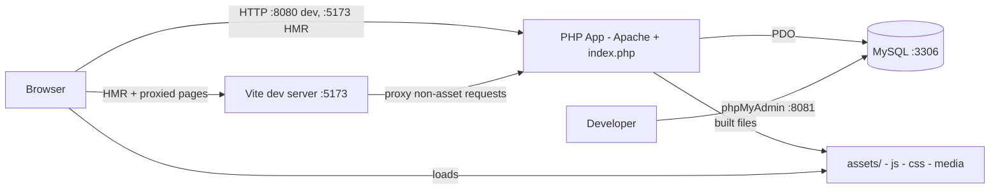
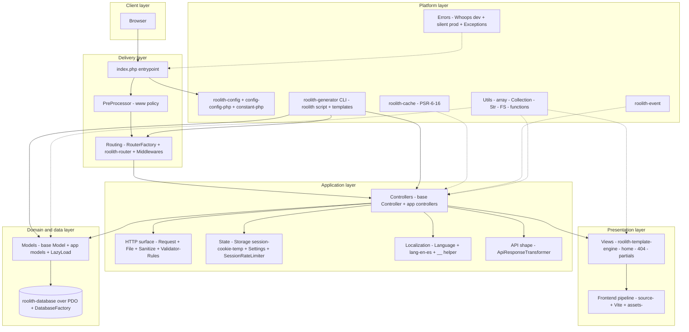
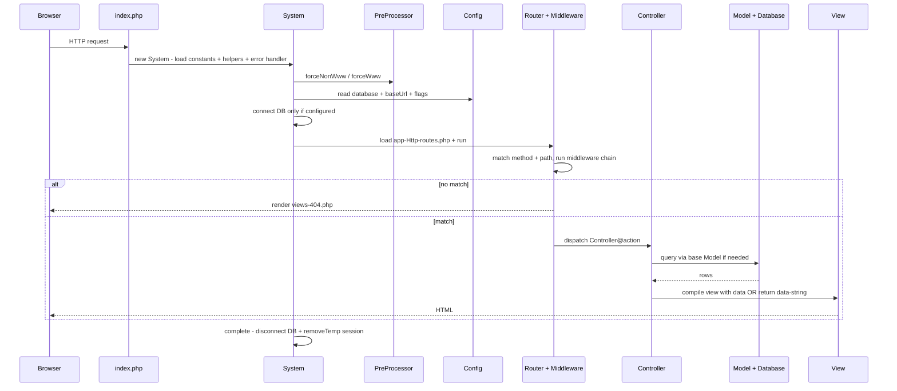

# Architecture

Roolith is a minimal, synchronous PHP micro-framework with an MVC shape. One PHP entrypoint boots shared services, routes one HTTP request to one controller action, optionally touches a relational database, renders a PHP view or returns data, then tears down per-request resources.

The framework itself is thin glue (`app/`, `config/`, `views/`, `index.php`, `constant.php`) over seven standalone, composable Roolith libraries shipped via Composer (`router`, `config`, `database`, `template-engine`, `cache`, `event`, `generator`), plus `nesbot/carbon` for time and `filp/whoops` for dev errors. There is no DI container, no background worker, and no built-in ORM relationship manager. Shared services are exposed through small singleton factories and static facades.

This page is the docs-site version of the system overview. The repository root holds the full [ARCHITECTURE.md](https://github.com/im4aLL/roolith-framework/blob/master/ARCHITECTURE.md) with the same diagrams and more detail. For the file layout, see [Getting Started](/getting-started).

## Design principles

- Minimal core, composable packages: each `roolith/*` library is usable outside the framework, and the app only pays for what it configures (for example the database connection is skipped when `database` config is null).
- Convention over configuration: fixed locations for routes (`app/Http/routes.php`), controllers (`app/Controllers`), models (`app/Models`), views (`views/`), config (`config/config.php`), and constants (`constant.php`).
- Synchronous request scope: all per-request state lives in PHP superglobals and the session; cleanup (`disconnect`, `removeTemp`) happens at the end of each request in `System::complete()`.
- Explicit extension points instead of hidden magic: routes, middleware, base `Controller`, base `Model`, view partials, language files, generator templates, and the optional CMS mode (`APP_ENABLE_CMS`).
- Observable early: Vite HMR plus full-page reload on PHP change in development, and Whoops error pages outside production.

## System context

In production the browser talks directly to the PHP container (or any Apache/PHP host); Vite and phpMyAdmin are development and operations aids. The only durable runtime dependency is MySQL, and it is optional: with `database` set to null the app runs without any database. See [Docker](/docker) and [Frontend Workflow](/frontend-workflow).

## Layered architecture

Dependency rule: delivery depends on application, application depends on domain/data and presentation, and everything depends on the platform layer. The reverse never happens: the vendor libraries never import from `App`.

## Request lifecycle

The happy path is `bootstrap -> processRequest -> complete`, all orchestrated by `App\Core\System` from `index.php`. See [Getting Started](/getting-started) for the bootstrap snippet.

Key lifecycle facts: session is started in `index.php`; `PreProcessor` may redirect before routing; `complete()` always clears one-shot temp session data and disconnects the database; unhandled bootstrap errors are printed as plain messages while dev runtime errors render through Whoops.

## Subsystems

### Entrypoint and bootstrap

Owns process boundaries: defines `APP_ROOT`, sets timezone, starts the session, loads Composer autoloading, then delegates to `System`. `System` loads path constants (`ROOLITH_CONFIG_ROOT`, `APP_VIEW_ROOT`), the optional CMS constants file, and global helpers; registers the error mode; applies URL canonicalization; lazily connects to the database; loads routes; and cleans up after the response. This is the only place that knows the full startup and shutdown order.

### Configuration and environment

Two tiers: build-time constants (view root, config root, `APP_ENABLE_CMS`, optional `ROOLITH_ENV`) and runtime config (`baseUrl`, `viteDevServer`, `database`, `forceNonWww`, `version`). Helpers expose environment predicates (`isDevEnvironment`, `isProductionEnvironment`), URL builders (`url`, `route`, `redirectToRoute`), and versioned asset URLs (`getVersion`). An unset `ROOLITH_ENV` means development; setting it to `production` silences display errors. See [Configuration](/configuration) and [Using Dot ENV](/using-dot-env).

### Routing and middleware

`RouterFactory` holds one shared router instance. `routes.php` configures `baseUrl` and view directory, declares HTTP verb routes to closures or `Controller@method` strings, assigns names for reverse routing (`route('welcome.form')`, `getActiveRoute()`), and conditionally mounts CMS routes when `APP_ENABLE_CMS` is true. Middleware extends the router base `Middleware` and votes allow or deny via `process(request, response)` before the controller runs. The router also owns the 404 fallback to `views/404.php`. See [Routing](/routing) and [Middleware](/middleware).

### Controllers

Controllers are the application orchestration point: read input via `Request`, validate via `Validator`, load data via models, pick an HTML view or a data response. The base `Controller` only provides view compilation through a shared template engine instance preconfigured with `baseUrl`. Controllers stay thin by pushing sanitization, validation, persistence, and formatting into their respective subsystems. See [Controllers](/controllers).

### Presentation

Server rendering uses plain PHP templates with `inject` for partials (`partials/header`, `partials/footer`) and `escape` for output. `TemplateEngineFactory` binds the engine to `APP_VIEW_ROOT` once. Standard views are `home.php` for the demo page and `404.php` for unmatched routes. See [Views](/views) and [Custom View Engine](/custom-view-engine).

### HTTP surface

`Request` is a static facade over `$_GET`, `$_POST`, `php://input`, `$_FILES`, `$_COOKIE`, and `$_SERVER`, with sanitization applied by default and an explicit unsafe path when raw input is needed. `Sanitize` strips tags and scripts and constrains params, emails, and strings. `Validator` checks an input map against a fluent `Rules` declaration per field and reports `success`, `fails`, and `errors`. `File` validates extension, size, and upload error, then moves uploads through the `FS` utility. Together they form the trust boundary between the network and the app. See [Request](/request), [Validation](/validation), and [File Upload](/file-upload).

### Domain and data

The base `Model` binds one class to one table plus primary key and exposes three access styles: full-table fetch (`all`), fluent query builder (`orm`), and raw connection (`raw`). `DatabaseFactory` holds one shared PDO-backed `Database` in non-debug mode. There are no declarative relations; `LazyLoad::with(model, foreignKey, localKey)` performs one batched manual eager load and attaches results to a result set. See [Models](/models), [Database](/database), [Migration](/migration), [Seeder](/seeder), [Extending a Model](/extending-a-model), [Custom ORM (Doctrine)](/custom-orm), and [Custom ORM (Cycle)](/cycle-orm).

### State and abuse control

`Storage` wraps cookies, sessions, and one-shot flash data (`temp` read once per next request, cleared in `System::complete`). `Settings` persists the locale in a cookie with an `en` default. `SessionRateLimiter` tracks timestamps per key in the session and reports `tooManyAttempts` inside a sliding window, with explicit `clear` on success. All three are session-backed and therefore single-server local unless the deployer externalizes PHP sessions. See [Storage](/storage).

### Localization

`Language` lazy-loads `lang/{locale}/message.php` dictionaries; the global `__()` helper resolves dotted keys for the active locale from `Settings::getLang()`. Adding a locale is adding one directory plus message file, with no code change. See [Localization](/localization).

### Standard utilities

Framework-wide helpers with no HTTP or DB dependencies: array manipulation (`_`), fluent lists (`Collection`), strings and messages (`Str`), filesystem (`FS`), and global functions for debugging (`p`), URLs, redirects, IP detection, dates via Carbon, and Vite tags. `ApiResponseTransformer` standardizes JSON-style envelopes as `{status, payload, message}` for API actions. See [Array Helpers](/array-helpers) and [Date Helpers](/date-helpers).

### Platform packages

The seven Roolith packages provide routing, configuration, database access, templating, PSR-6/16 caching, events, and scaffolding. Cache and event are shipped capabilities consumed on demand by app code rather than wired into every request. Carbon standardizes dates and cookie expirations; Whoops standardizes dev diagnostics. This separation keeps the framework replaceable piece by piece. See [Cache](/cache) and [Events](/events).

### Scaffolding

The `php roolith generate` CLI stamps out controllers, models, and middleware from text templates into their conventional directories. It accelerates bootstrapping but imposes no runtime dependency; generated files are ordinary app code from then on. See [Generator](/generator).

### Frontend delivery

Authoring lives in `source/js/app.js` and `source/scss/app.scss`; built output lives in `assets/js` and `assets/css`. Two modes exist: HMR mode when `viteDevServer` points at `http://localhost:5173` (Vite serves assets and proxies all other paths to PHP on `:8080`, with full reload on PHP edits), and static mode otherwise (views emit versioned `assets/` URLs via `viteJs` and `viteCss`). Optional admin entries are picked up only if their source files exist. The PHP app never bundles JavaScript itself; it only emits the correct script and link tags per mode. See [Frontend Workflow](/frontend-workflow).

### Operations

Local production parity comes from three containers: Apache/PHP app on `:8080` with the repo bind-mounted, MySQL 8 on `:3306`, and phpMyAdmin on `:8081`. `.htaccess` routes clean URLs to the front controller. `installer.zip` carries the optional CMS admin sources. See [Docker](/docker).

## Data architecture

The operational data store is MySQL accessed over PDO through `roolith/database`. The base model assumes one table per model class and a single-column primary key defaulting to `id`. Reads flow `Controller -> Model::orm() -> Database -> MySQL`; writes use the same path. Ephemeral state (flash messages, rate-limit counters, locale cookie reference, language dictionaries) lives in the session, cookies, or in-memory per request. File uploads land on the local filesystem via `FS::upload`. No cache or queue is required for the default flow.

## Cross-cutting concerns

- Error handling: Whoops pretty pages in development, silent logging posture in production, plus typed app exceptions for bootstrap and template failures.
- Security: sanitize-on-read inputs, escaped view output, upload allowlist plus size cap, session-backed rate limiting, and www canonicalization to reduce duplicate-origin issues.
- Observability: minimal by design; version query strings for cache busting, active-route helper for navigation state, and conventional places to add logging (System lifecycle, middleware, model access).
- Conventions as contracts: factories guarantee one shared router, view engine, and database handle per request; global helpers guarantee stable URL, redirect, asset, and i18n seams. See [Sending Email](/sending-email) for an example of adding a cross-cutting integration.

## Extension map

| To change | Touch | Leave alone |
|---|---|---|
| URLs and access control | `app/Http/routes.php`, `app/Middlewares/*` | `RouterFactory`, vendor router |
| Page behavior | `app/Controllers/*` extending base `Controller` | `System`, `index.php` |
| Page markup | `views/*.php`, `views/partials/*` | template engine package |
| Domain reads and writes | `app/Models/*` extending base `Model`, `LazyLoad` | `DatabaseFactory` unless connection policy changes |
| Input rules | `Validator` plus `Rules` declarations in controllers | `Sanitize` primitives |
| Locales | `lang/{locale}/message.php` | `Language`, `Settings` |
| Frontend assets | `source/js`, `source/scss`, `vite.config.mjs` | view helpers `viteJs`, `viteCss` |
| Scaffolds | `app/Core/generator-templates/*.txt` | `roolith` script wiring |
| CMS mode | `APP_ENABLE_CMS`, CMS constants and routes | core lifecycle |
| Persistence engine | custom ORM or view engine docs | controller call sites if the `Model` facade is preserved |

## Constraints and tradeoffs

- Single-request PHP execution with no async path; long-running work must move outside the request or block the response.
- Singleton factories simplify sharing but hide dependencies; testing benefits from resetting or replacing those instances.
- Session-local rate limiting and temp data do not scale horizontally without shared session storage.
- Manual eager loading avoids ORM magic at the cost of explicit `with()` calls for every association.
- Static facades (`Request`, `Storage`, `Sanitize`) optimize for brevity over explicit injection; the interface files under `app/Core/Interfaces` are the seam to introduce injection later.

## Repository to architecture map

`index.php` is the process entry; `constant.php` plus `config/config.php` are configuration; `app/Http` is delivery wiring; `app/Controllers` plus `views` are application and presentation; `app/Models` plus `app/Core/DatabaseFactory.php` are data access; `app/Core` holds HTTP, validation, state, i18n, and lifecycle services; `app/Utils` holds dependency-free helpers; `app/Middlewares` holds edge policy; `source` and `assets` are frontend authoring and output; `lang` is localization data; `vendor/roolith/*` is the replaceable platform; `roolith` plus `app/Core/generator-templates` is scaffolding; `Dockerfile`, `docker-compose.yml`, and `.htaccess` are operations.
