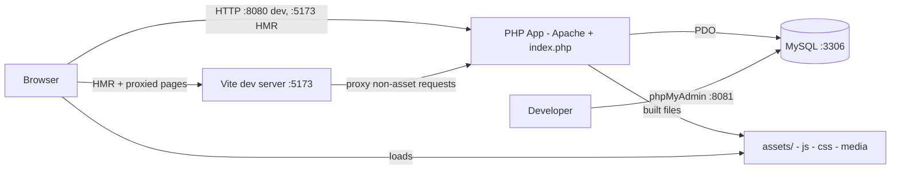
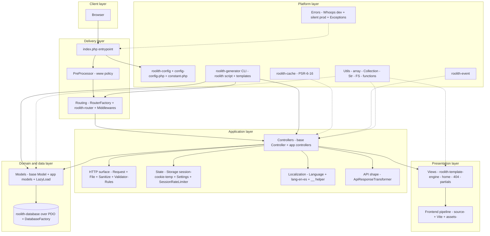
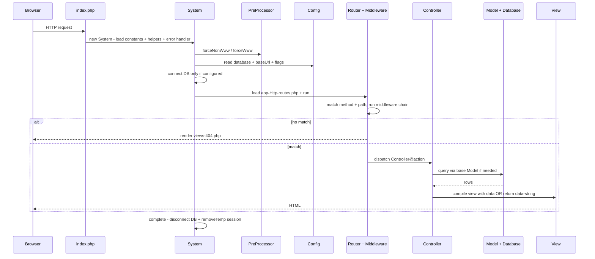

# Architecture

> Canonical source: `ARCHITECTURE.md` at the repo root is the single source of truth. This page is a short mirror; when they differ, `ARCHITECTURE.md` wins.

Roolith is a minimal, synchronous PHP micro-framework with an MVC shape. One entrypoint boots shared services, routes one HTTP request to one controller action, optionally touches the database, renders a view, then cleans up.

The framework is thin glue (`app/`, `config/`, `views/`, `index.php`, `constant.php`) over seven standalone `roolith/*` Composer libraries, plus Carbon for time and Whoops for dev errors. There is no DI container, no background worker, and no built-in ORM relationship manager.

This page is the short, scannable overview. The repository root holds the full [ARCHITECTURE.md](https://github.com/im4aLL/roolith-framework/blob/master/ARCHITECTURE.md) with more detail. For the file layout, see [Getting Started](/getting-started).

## The mental model in 30 seconds

- **One request, one path:** `index.php` -> `System` -> Router -> one `Controller@action` -> View or data -> cleanup.
- **Convention over configuration:** routes live in `app/Http/routes.php`, controllers in `app/Controllers`, models in `app/Models`, views in `views/`.
- **Pay for what you use:** the database connection is skipped when `database` config is `null`. Cache and events exist but only run when your code calls them.

## Design principles

- Minimal core, composable packages: each `roolith/*` library works outside the framework.
- Convention over configuration: fixed locations for routes, controllers, models, views, config, and constants.
- Synchronous request scope: per-request state lives in superglobals and session; `System::complete()` cleans up with `disconnect` and `removeTemp`.
- Explicit extension points: routes, middleware, base `Controller`, base `Model`, view partials, language files, generator templates, and `APP_ENABLE_CMS`.
- Observable early: Vite HMR plus full-page reload on PHP change, and Whoops error pages outside production.

## Where things run

- In production the browser talks directly to the PHP container (or any Apache/PHP host). Vite and phpMyAdmin are dev/ops aids only.
- MySQL is the only durable dependency, and it is optional: with `database` set to `null` the app runs without any database.
- See [Docker](/docker) and [Frontend Workflow](/frontend-workflow).

## How code is layered

| Layer | Owns | Examples |
|---|---|---|
| Delivery | Entry, URL policy, routing | `index.php`, `PreProcessor`, `RouterFactory` |
| Application | Request orchestration | Controllers, `Request`, `Validator`, `Storage`, `Language` |
| Presentation | HTML output | `views/`, template engine, `source/` + `assets/` |
| Domain and data | Persistence | Base `Model`, app models, `DatabaseFactory` |
| Platform | Shared, dependency-free services | Config, cache, events, utils, errors, generator |

::: info Dependency rule
Delivery depends on application, application depends on domain/data and presentation, and everything depends on platform. The reverse never happens: vendor libraries never import from `App`.
:::

## How a request flows

The happy path is `bootstrap -> processRequest -> complete`, orchestrated by `App\Core\System` from `index.php`. See [Getting Started](/getting-started) for the bootstrap snippet.

1. `index.php` starts the session and delegates to `System`.
2. `System` loads constants, helpers, and the error mode.
3. `PreProcessor` applies `forceNonWww` / `forceWww` (may redirect before routing).
4. `System` reads config and connects to the DB only if configured.
5. Router matches method + path and runs the middleware chain.
6. On match, one `Controller@action` runs: reads input, optionally queries models, renders a view or returns data. On no match, `views/404.php` renders.
7. `System::complete()` clears one-shot temp session data and disconnects the DB.

::: tip Errors
Unhandled bootstrap errors print as plain messages. Runtime errors in dev render through Whoops.
:::

## Subsystems

Grouped by what you are trying to do. Each entry lists what it does, the key files, and where to read more.

### A. Handling a request

#### Entrypoint and bootstrap

Owns process boundaries and the full startup/shutdown order. Nothing else knows this order.

- Defines `APP_ROOT`, sets timezone, starts session, loads Composer autoloading, delegates to `System`.
- `System` loads path constants (`ROOLITH_CONFIG_ROOT`, `APP_VIEW_ROOT`), optional CMS constants, and global helpers.
- Registers error mode, applies URL canonicalization, lazily connects DB, loads routes, cleans up after response.

Key files: `index.php`, `app/Core/System.php`, `constant.php`.

#### Configuration and environment

Two tiers: build-time constants and runtime config.

- Constants: view root, config root, `APP_ENABLE_CMS`, optional `ROOLITH_ENV` (unset `APP_ENV` defaults to production fail-closed; only `APP_ENV=development` enables Whoops).
- Runtime config: `baseUrl`, `viteDevServer`, `database`, `forceNonWww`, `version`.
- Helpers: `isDevEnvironment`, `isProductionEnvironment`, `url`, `route`, `redirectToRoute`, `getVersion`.

See [Configuration](/configuration) and [Using Dot ENV](/using-dot-env).

#### Routing and middleware

- `RouterFactory` holds one shared router instance.
- `routes.php` sets `baseUrl` and view directory, declares verb routes to closures or `Controller@method`, names routes for reverse routing (`route('welcome.form')`, `getActiveRoute()`).
- Conditionally mounts CMS routes when `APP_ENABLE_CMS` is true.
- Middleware extends the router base `Middleware` and votes allow/deny via `process(request, response)` before the controller runs.
- Router owns the 404 fallback to `views/404.php`.

See [Routing](/routing) and [Middleware](/middleware).

#### Controllers

The orchestration point. Keep them thin.

- Read input via `Request`, validate via `Validator`, load data via models.
- Pick an HTML view or a data response.
- Base `Controller` only provides view compilation through a shared template engine preconfigured with `baseUrl`.

See [Controllers](/controllers).

### B. Rendering, input, and data

#### Presentation

- Plain PHP templates with `inject` for partials (`partials/header`, `partials/footer`) and `escape` for output.
- `TemplateEngineFactory` binds the engine to `APP_VIEW_ROOT` once.
- Standard views: `home.php` (demo page), `404.php` (unmatched routes).

See [Views](/views) and [Custom View Engine](/custom-view-engine).

#### HTTP surface: input trust boundary

- `Request`: static facade over `$_GET`, `$_POST`, `php://input`, `$_FILES`, `$_COOKIE`, `$_SERVER`. Sanitized by default, with an explicit unsafe path for raw input.
- `Sanitize`: strips tags/scripts, constrains params, emails, strings.
- `Validator` + `Rules`: checks an input map per field, reports `success`, `fails`, `errors`.
- `File`: validates extension, size, upload error, then moves uploads via `FS`.

See [Request](/request), [Validation](/validation), and [File Upload](/file-upload).

#### Domain and data

- Base `Model`: one class to one table plus primary key.
- Three access styles: `all` (full-table fetch), `orm` (fluent query builder), `raw` (raw connection).
- `DatabaseFactory`: one shared PDO-backed `Database` in non-debug mode.
- No declarative relations: `LazyLoad::with(model, foreignKey, localKey)` does one batched manual eager load.

See [Models](/models), [Database](/database), [Migration](/migration), [Seeder](/seeder), [Extending a Model](/extending-a-model), [Custom ORM (Doctrine)](/custom-orm), and [Custom ORM (Cycle)](/cycle-orm).

### C. App state and helpers

#### State and abuse control

All session-backed and single-server local unless PHP sessions are externalized.

- `Storage`: cookies, sessions, one-shot flash data (`temp`, cleared in `System::complete`).
- `Settings`: locale persisted in a cookie, `en` default.
- `SessionRateLimiter`: timestamps per key in session, `tooManyAttempts` in a sliding window, explicit `clear` on success.

See [Storage](/storage).

#### Localization

- `Language` lazy-loads `lang/{locale}/message.php` dictionaries.
- Global `__()` helper resolves dotted keys for the active locale from `Settings::getLang()`.
- Adding a locale = adding one directory plus message file, no code change.

See [Localization](/localization).

#### Standard utilities

Dependency-free helpers used everywhere:

- Array manipulation (`_`), fluent lists (`Collection`), strings/messages (`Str`), filesystem (`FS`).
- Global functions: `p` (debug), URLs, redirects, IP detection, dates via Carbon, Vite tags.
- `ApiResponseTransformer`: `{status, payload, message}` envelopes for API actions.

See [Array Helpers](/array-helpers) and [Date Helpers](/date-helpers).

### D. Platform, delivery, and operations

#### Platform packages

The seven Roolith packages: routing, configuration, database, templating, PSR-6/16 caching, events, scaffolding.

- Cache and events are on-demand capabilities, not wired into every request.
- Carbon standardizes dates and cookie expirations. Whoops standardizes dev diagnostics.

See [Cache](/cache) and [Events](/events).

#### Scaffolding

- `php roolith generate` stamps out controllers, models, and middleware from text templates.
- No runtime dependency: generated files are ordinary app code from then on.

See [Generator](/generator).

#### Frontend delivery

- Author in `source/js/app.js` and `source/scss/app.scss`; ship hashed files from `assets/build/js` and `assets/build/css` via `assets/build/.vite/manifest.json`.
- HMR mode when `viteDevServer` points at `http://localhost:5173` (Vite serves assets, proxies other paths to PHP on `:8080`, full reload on PHP edits).
- Static mode otherwise: views emit hashed `assets/build/` URLs via `viteJs` and `viteCss`.
- Uploads live outside the build output (`public/uploads/` or `storage/`).
- The PHP app never bundles JS itself; it only emits the correct tags per mode.

See [Frontend Workflow](/frontend-workflow).

#### Operations

- Dev `docker-compose.yml` bind-mounts the repo; prod-like `docker-compose.prod.yml` runs from the `COPY` with a named volume for `public/uploads`. MySQL uses a `mysqladmin ping` healthcheck plus `depends_on: service_healthy`.
- `.htaccess` routes clean URLs to the front controller and denies `installer.zip` with 404.
- CMS admin sources stay tracked in git as `installer.zip` for reference and local install (owner decision Sep 2026) but are omitted from dist via `composer.json` `archive.exclude` plus `.gitattributes` `export-ignore` plus `.dockerignore`.

See [Docker](/docker) and [CMS installer](/cms-installer).

## Data: what lives where

Reads and writes flow `Controller -> Model::orm() -> Database -> MySQL`. The base model assumes one table per class and a single-column primary key defaulting to `id`.

| Kind | Where | Examples |
|---|---|---|
| Durable | MySQL over PDO via `roolith/database` | App tables |
| Ephemeral | Session, cookies, in-memory per request | Flash messages, rate-limit counters, locale reference, language dictionaries |
| Files | Local filesystem via `FS::upload` | Uploads |

No cache or queue is required for the default flow.

## Cross-cutting concerns

- **Errors:** Whoops pretty pages in dev, silent posture in prod, typed app exceptions for bootstrap and template failures.
- **Security:** sanitize-on-read inputs, escaped view output, upload allowlist plus size cap, session-backed rate limiting, www canonicalization.
- **Observability:** minimal by design. Version query strings for cache busting, `getActiveRoute()` for navigation state. Add logging in `System`, middleware, or model access.
- **Conventions as contracts:** factories guarantee one shared router, view engine, and DB handle per request. Global helpers guarantee stable URL, redirect, asset, and i18n seams. See [Sending Email](/sending-email) for adding an integration.

## Extension map

| To change | Touch | Leave alone |
|---|---|---|
| URLs and access control | `app/Http/routes.php`, `app/Middlewares/*` | `RouterFactory`, vendor router |
| Page behavior | `app/Controllers/*` extending base `Controller` | `System`, `index.php` |
| Page markup | `views/*.php`, `views/partials/*` | template engine package |
| Domain reads and writes | `app/Models/*` extending base `Model`, `LazyLoad` | `DatabaseFactory` unless connection policy changes |
| Input rules | `Validator` plus `Rules` declarations in controllers | `Sanitize` primitives |
| Locales | `lang/{locale}/message.php` | `Language`, `Settings` |
| Frontend assets | `source/js`, `source/scss`, `vite.config.mjs` | view helpers `viteJs`, `viteCss` |
| Scaffolds | `app/Core/generator-templates/*.txt` | `roolith` script wiring |
| CMS mode | `APP_ENABLE_CMS=1` plus CMS release asset (see CMS installer) | core lifecycle |
| Persistence engine | custom ORM or view engine docs | controller call sites if the `Model` facade is preserved |

## Constraints and tradeoffs

- Single-request PHP execution with no async path; long-running work must move outside the request or block the response.
- Singleton factories simplify sharing but hide dependencies; reset or replace those instances in tests.
- Session-local rate limiting and temp data do not scale horizontally without shared session storage.
- Manual eager loading avoids ORM magic at the cost of explicit `with()` calls per association.
- Static facades (`Request`, `Storage`, `Sanitize`) optimize for brevity over injection; `app/Core/Interfaces` is the seam to introduce injection later.

## Where to find things

| Path | Role |
|---|---|
| `index.php` | Process entry |
| `constant.php`, `config/config.php` | Configuration |
| `app/Http` | Delivery wiring (routes) |
| `app/Controllers`, `views` | Application and presentation |
| `app/Models`, `app/Core/DatabaseFactory.php` | Data access |
| `app/Core` | HTTP, validation, state, i18n, lifecycle |
| `app/Utils` | Dependency-free helpers |
| `app/Middlewares` | Edge policy |
| `source`, `assets` | Frontend authoring and output |
| `lang` | Localization data |
| `vendor/roolith/*` | Replaceable platform |
| `roolith`, `app/Core/generator-templates` | Scaffolding |
| `Dockerfile`, `docker-compose.yml`, `.htaccess` | Operations |
