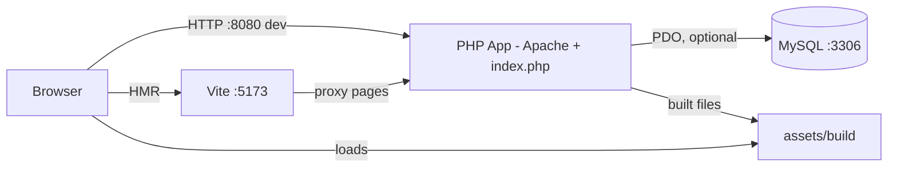
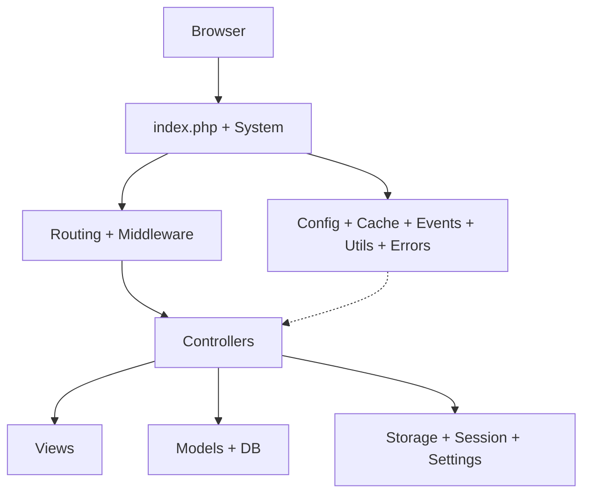
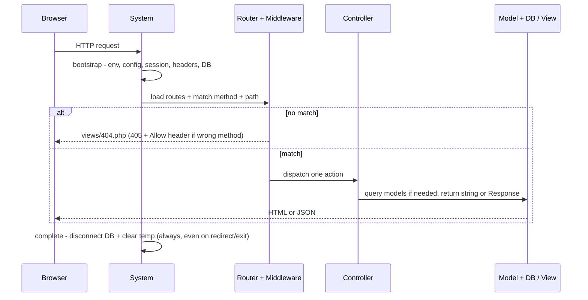

# Architecture

> Canonical source: `ARCHITECTURE.md` at the repo root is the single source of truth. This page is a short, scannable mirror; when they differ, `ARCHITECTURE.md` wins.

Roollith is a minimal, synchronous PHP micro-framework with an MVC shape. One entrypoint boots shared services, routes one HTTP request to one controller action, optionally touches the database, renders a view, then cleans up.

The framework is thin glue (`app/`, `config/`, `views/`, `index.php`, `constant.php`) over seven standalone `roolith/*` Composer libraries, plus Carbon for time and Whoops for dev errors. There is no app-level container (only per-service factories), no background worker, and no built-in ORM relationship manager.

Full detail lives in [ARCHITECTURE.md](https://github.com/im4aLL/roolith-framework/blob/next/ARCHITECTURE.md). For the file layout, see [Getting Started](/getting-started).

## The mental model in 30 seconds

- **One request, one path:** `index.php` -> `System::run()` -> Router -> one `Controller@action` -> View or `Response` -> cleanup.
- **Convention over configuration:** routes in `app/Http/routes.php`, controllers in `app/Controllers`, models in `app/Models`, views in `views/`.
- **Pay for what you use:** the DB connection is skipped when `database` config is `null`. Cache and events only run when your code calls them.

## Design principles

- Minimal core, composable packages: each `roolith/*` library works outside the framework.
- Fixed locations for routes, controllers, models, views, config, and constants.
- Synchronous request scope: per-request state lives in superglobals and session; `System::complete()` cleans up (`disconnect` + `removeTemp`).
- Explicit extension points: routes, middleware, base `Controller`, base `Model`, view partials, language files, generator templates, `APP_ENABLE_CMS`.
- Observable early: Vite HMR plus full-page reload on PHP change, Whoops pages in development only.

## Where things run

- Production: browser talks directly to PHP. Vite and phpMyAdmin are dev aids only.
- MySQL is the only durable dependency, and it is optional (`database: null` runs DB-less).
- See [Docker](/docker) and [Frontend Workflow](/frontend-workflow).

## How code is layered

| Layer | Owns | Examples |
|---|---|---|
| Delivery | Entry, URL policy, routing | `index.php`, `System`, `PreProcessor`, `RouterFactory` |
| Application | Request orchestration | Controllers, `Request`, `Validator`, `Storage`, `Language` |
| Presentation | HTML output | `views/`, template engine, `source/` + `assets/build` |
| Domain and data | Persistence | Base `Model`, app models, `DatabaseFactory`, `Migrator`/`Seeder` |
| Platform | Shared, dependency-free services | Config, cache, events, utils, errors, generator |

::: info Dependency rule
Delivery depends on application, application depends on domain/data and presentation, everything depends on platform. Vendor libraries never import from `App`.
:::

## How a request flows

`System::run()` never throws. It wraps `bootstrap -> processRequest -> complete`, emits redirects, and routes failures to `ErrorHandler`.

1. `index.php` calls `System::run()`. `System` loads `.env`, constants, helpers, trace id plus logger, and the error mode (Whoops in development only).
2. `bootstrap()` validates config (`ConfigValidator`), starts the session (`Session::start()`), sends security headers, applies `forceNonWww`/`forceWww` (301, allowlisted, `RedirectException` on match), and connects to the DB only if configured. See [Security](/security) and [Configuration](/configuration).
3. `processRequest()` resets `RouterFactory`, loads `routes.php`, validates handlers log-only (`php roolith route:list` is the lint tool), matches method plus path, and runs the middleware chain (`NextMiddlewareInterface::process(request, next)`). See [Routing](/routing) and [Middleware](/middleware).
4. One controller action runs: reads raw input via `Request`, validates via `Validator`, queries via models, returns `string|App\Core\Response` (HTML via `view():string`, JSON via `$this->json()`). See [Controllers](/controllers), [Request](/request), [Response](/response).
5. `RouterResponse` emits the result. `complete()` clears one-shot temp data and disconnects the DB (idempotent, also runs on redirect and shutdown). Failures go to `ErrorHandler` with trace id (rethrow in dev, generic 500 in prod). See [Error Handling](/error-handling) and [Logging](/logging).

## Subsystems at a glance

Details live in dedicated pages. This table is the map, not the manual.

| You want to | Reach for | Read more |
|---|---|---|
| Boot, config, env | `System`, `Env`, `ConfigValidator`, `config/config.php` | [Configuration](/configuration), [Using Dot ENV](/using-dot-env) |
| URLs and access control | `routes.php`, `RouterFactory`, `app/Middlewares/*` | [Routing](/routing), [Middleware](/middleware), [CLI](/cli) |
| Page behavior | `app/Controllers/*` + base `Controller` (`view()`, `json()`) | [Controllers](/controllers), [Response](/response) |
| Page markup | `views/*.php`, `inject`, `escape`, `viteJs`/`viteCss` | [Views](/views), [Custom View Engine](/custom-view-engine) |
| Input and files | `Request` (raw), `Sanitize::param()`/`email()` (narrow), `File` + `FS` | [Request](/request), [Validation](/validation), [File Upload](/file-upload) |
| Validation rules | `Validator` + `Rules` per field (`success`/`fails`/`errors`) | [Validation](/validation) |
| Reads and writes | Base `Model` (`all`/`orm`/`raw`), `$fillable`, `$casts`, `LazyLoad::with()` | [Models](/models), [Database](/database), [Extending a Model](/extending-a-model) |
| Schema and seeds | `Migrator` (`migrate*`), `Seeder` (`seed*`), `DatabaseFactory::transaction()` | [Migration](/migration), [Seeder](/seeder), [CLI](/cli) |
| Cookies and sessions | `Storage`, `Session` (`start`/`regenerate`), `Settings` (locale) | [Storage](/storage), [Session](/session) |
| Abuse control | `SessionRateLimiter` (`hit`/`tooManyAttempts`/`clear`) | [Middleware](/middleware), [Security](/security) |
| Text and locale | `Language`, `trans()` (`__()` is a BC alias), `lang/{locale}/` | [Localization](/localization) |
| Helpers | `Arr`, `Collection`, `Str`, `FS`, `Support/*` (`Url`, `Redirect`, `Html`, `Debug`, `IdGenerator`) | [Array Helpers](/array-helpers), [Collections](/collections), [Support Helpers](/support-helpers) |
| Dates | Carbon via `getCurrentDateTime()` etc. | [Date Helpers](/date-helpers) |
| Cache and events | `roolith/cache`, `roolith/event`, on-demand only | [Cache](/cache), [Events](/events) |
| Scaffolding | `php roolith generate` from `app/Core/generator-templates` | [Generator](/generator), [CLI](/cli) |
| Frontend assets | `source/` -> `assets/build/` (hashed, manifest), HMR via `viteDevServer` | [Frontend Workflow](/frontend-workflow) |
| Deploys | `Dockerfile`, `docker-compose.yml`, `docker-compose.prod.yml`, `.htaccess` | [Docker](/docker), [CMS Installer](/cms-installer) |

Notes worth knowing once:

- `Request::input()` returns raw values. Validate by type, escape at render with `escape()`. `Sanitize::any()/string()/items()` are legacy; only `param()` (slugs) and `email()` are current.
- `trans()` is canonical; `__()` is a BC alias. `Arr` is canonical; `_` is a BC alias for PHP 8.4.
- There are no declarative relations. `LazyLoad::with(model, foreignKey, localKey)` does one batched manual eager load.
- Cache and events are shipped but unwired: nothing calls them unless your code does.

## Data: what lives where

`Controller -> Model::orm() -> Database -> MySQL`. One table per model class, single-column primary key defaulting to `id`.

| Kind | Where | Examples |
|---|---|---|
| Durable | MySQL over PDO via `roolith/database` | App tables |
| Ephemeral | Session, cookies, in-memory per request | Flash messages, rate-limit counters, locale reference |
| Files | Local filesystem via `FS::upload` | Uploads |

No cache or queue is required for the default flow.

## Cross-cutting concerns

- **Errors:** Whoops in dev, silent 500 plus trace id in prod. See [Error Handling](/error-handling).
- **Security:** raw input plus render-time escaping, upload allowlist, rate limiting, canonical hosts, baseline headers. See [Security](/security).
- **Observability:** PSR-3 file logger with per-request trace id on bootstrap, routing, 404, and failures. See [Logging](/logging).
- **Conventions as contracts:** one shared router, view engine, and DB handle per request; `php roolith route:list` lints handlers. See [Testing](/testing).

## Extension map

| To change | Touch | Leave alone |
|---|---|---|
| URLs and access control | `app/Http/routes.php`, `app/Middlewares/*` | `RouterFactory`, vendor router |
| Page behavior | `app/Controllers/*` extending base `Controller` | `System`, `index.php` |
| Page markup | `views/*.php`, `views/partials/*` | template engine package |
| Domain reads and writes | `app/Models/*` extending base `Model`, `LazyLoad` | `DatabaseFactory` unless connection policy changes |
| Input rules | `Validator` plus `Rules` declarations in controllers | `Sanitize` primitives |
| Locales | `lang/{locale}/message.php` | `Language`, `Settings` |
| Frontend assets | `source/js`, `source/scss`, `vite.config.mjs` | view helpers `viteJs`, `viteCss` |
| Scaffolds | `app/Core/generator-templates/*.txt` | `roolith` script wiring |
| CMS mode | `APP_ENABLE_CMS=1` plus CMS release asset | core lifecycle |
| Persistence engine | custom ORM or view engine docs | controller call sites if the `Model` facade is preserved |

## Constraints and tradeoffs

- Single-request PHP execution with no async path; long work must move outside the request.
- Singleton factories simplify sharing but hide dependencies; reset or replace them in tests.
- Session-local rate limiting and temp data do not scale horizontally without shared session storage.
- Manual eager loading avoids ORM magic at the cost of explicit `with()` calls per association.
- Static facades (`Request`, `Storage`) optimize for brevity over injection; `app/Core/Interfaces` is the seam for injection later.

## Where to find things

| Path | Role |
|---|---|
| `index.php` | Thin process entry (`System::run()`) |
| `constant.php`, `config/config.php` | Configuration |
| `app/Http` | Delivery wiring (routes) |
| `app/Controllers`, `views` | Application and presentation |
| `app/Models`, `app/Core/DatabaseFactory.php`, `app/Database` | Data access, migrations, seeders |
| `app/Core` | HTTP, validation, state, i18n, lifecycle |
| `app/Utils`, `app/Support` | Dependency-free helpers |
| `app/Middlewares` | Edge policy |
| `source`, `assets/build` | Frontend authoring and output |
| `lang` | Localization data |
| `vendor/roolith/*` | Replaceable platform |
| `roolith`, `app/Core/generator-templates` | Scaffolding |
| `Dockerfile`, `docker-compose*.yml`, `.htaccess` | Operations |
